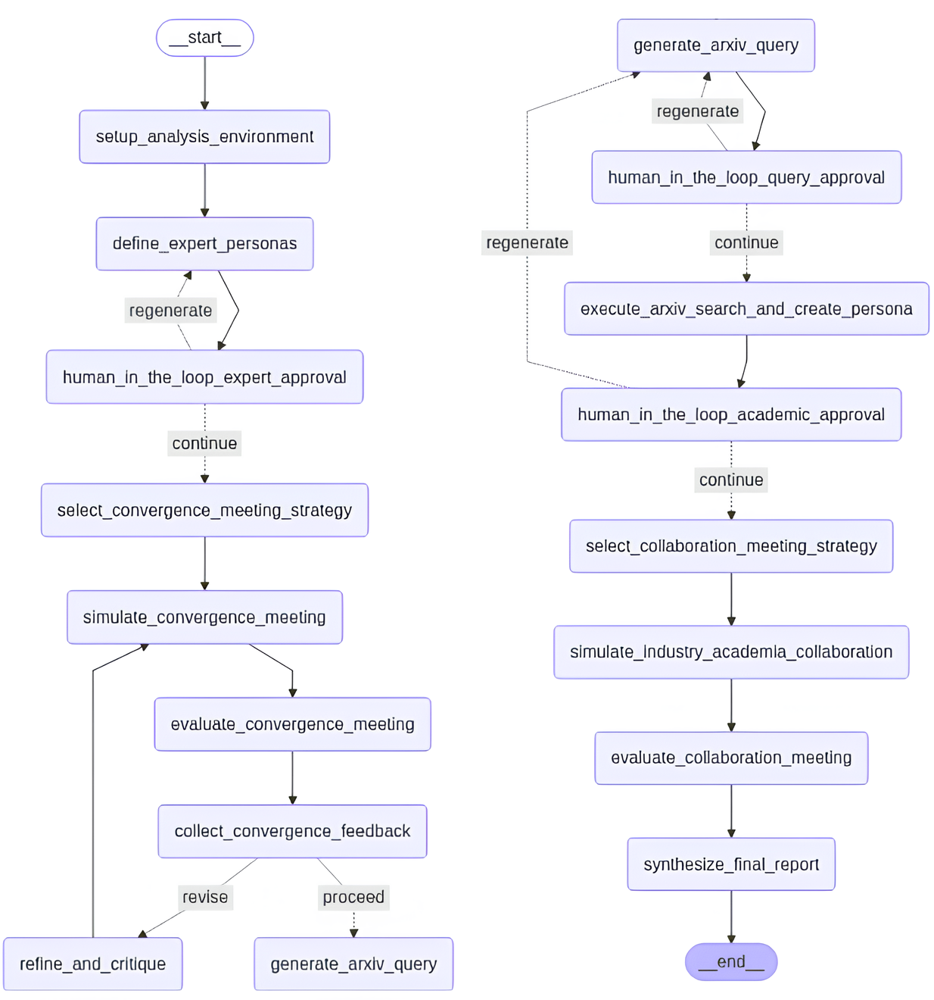
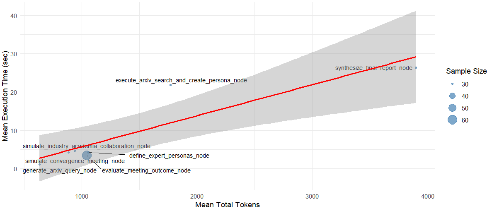
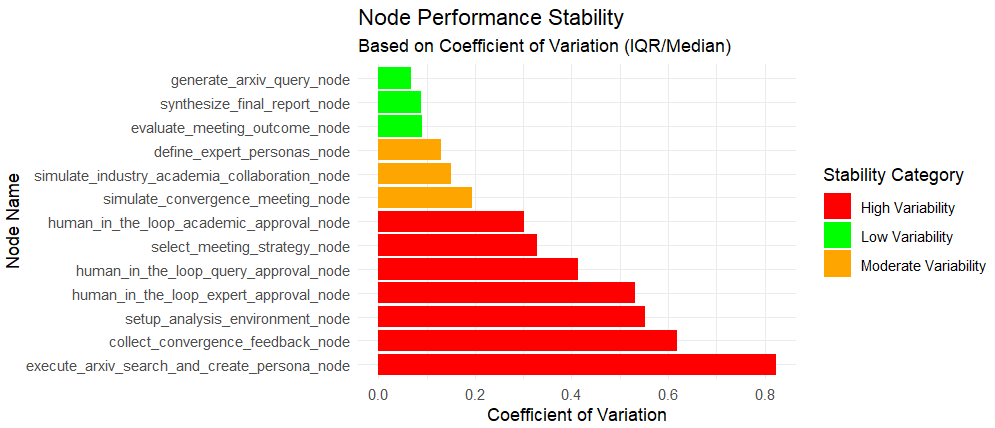
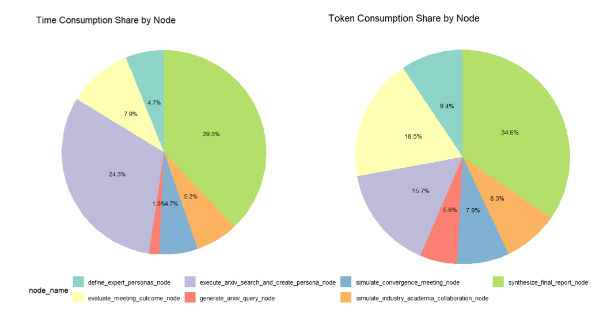
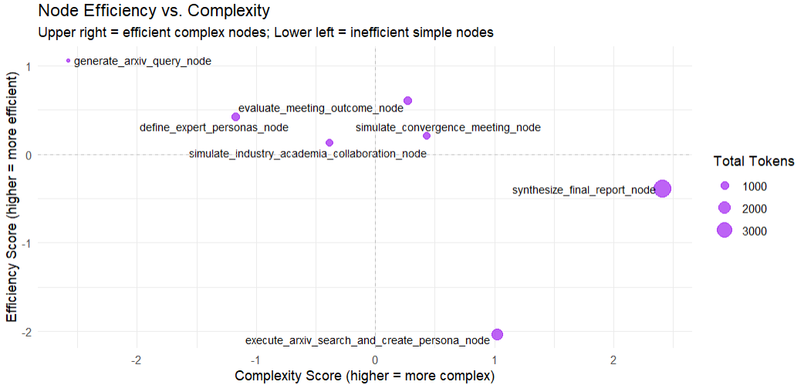
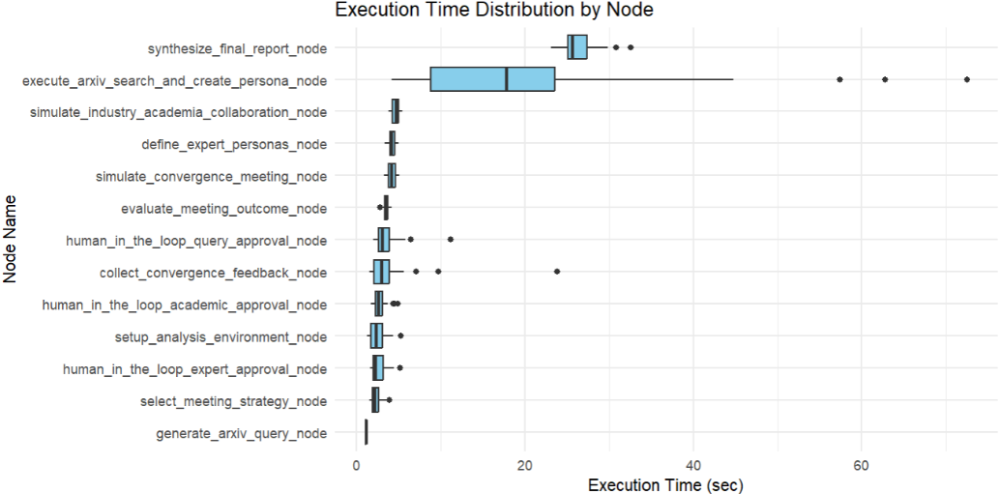
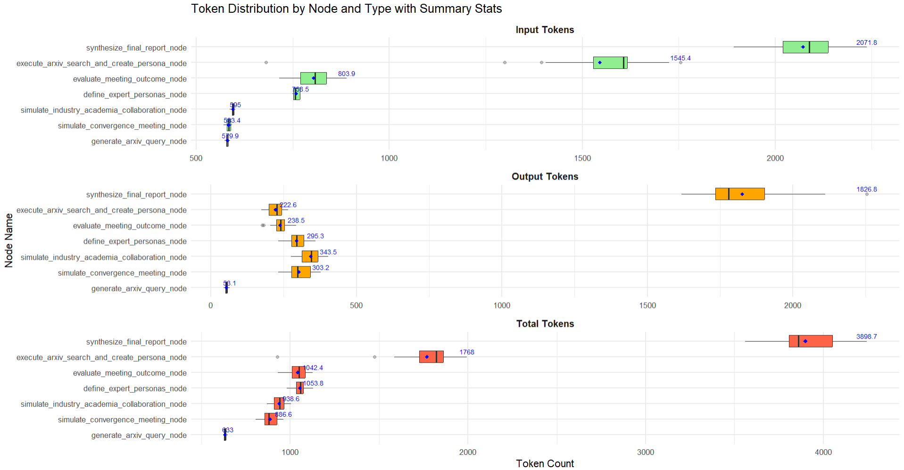

# LangGraph Workflow for Adaptive R&D Decision Processes

## 1. Overview

This repository presents a **LangGraph-based multi-agent framework** engineered for **dynamic and adaptive decision-making** in **industry–academia R&D collaboration**. By integrating **Large Language Models (LLMs)** with **structured, data-driven, agentic processes**, this framework simulates and optimizes real-world R&D planning through a Two-Track experimental architecture.

> **Journal:** *Information Systems Frontiers* (ISF) — Major Revision  
> **Contribution:** A step toward treating early-stage R&D innovation as a simulatable, data-grounded process — advancing, rather than definitively resolving, systematic R&D foresight.

The workflow features **expert-driven approvals**, **iterative feedback loops**, **conditional routing**, and a **non-LLM evaluation architecture** that eliminates evaluative circularity — addressing a critical gap in prior LLM-based innovation studies.

---

## Visual Workflow Overview



---

## 2. Key Features

**Data-Driven Persona Generation** — Automatically identifies and creates expert personas grounded in real-world patent inventor data (WIPO PCT), combined with ArXiv-based academic expert discovery.

**Convergence Signal Detection** — A Bayesian LSTM model (LSTM-Informed Bayesian Log-Linear Regression) identifies high-potential CPC technology convergence pairs using walk-forward validation. Reframed from "forecasting" to *convergence signal detection* to accurately reflect its primary function: short-window directional signal identification rather than quantitative point forecasting.

**Non-LLM Evaluation Architecture** — All six CQS scorers are discriminative, non-generative models (NLI DeBERTa, cross-encoder MiniLM, ST cosine similarity, QNLI, Jaccard rule, keyword density). This eliminates the "LLM-as-judge" circularity problem (Chang et al., 2023; Liu et al., 2023).

**Human-In-The-Loop (HITL) Oversight** — Key decisions are validated through expert review at multiple nodes, ensuring strategic alignment.

**Iterative Refinement** — Simulated meetings are evaluated, critiqued, and refined until a high-quality R&D proposal emerges.

**Multi-LLM Robustness** — Supports GPT-4, Phi-3-mini, Qwen2.5 (1.5B/3B), and Gemini, enabling comparative analysis across model scales.

**Detailed Logging & Monitoring** — Captures execution time, token usage, and decisions per node for performance optimization.

---

## 3. Two-Track Experimental Architecture

Empirical contributions are organized as a complementary Two-Track design, where each track answers a different validity question.

| | Track A | Track B |
|---|---|---|
| **Purpose** | Framework capability demonstration | Reproducibility + independent validation |
| **Sections** | Sections 4–5 of paper | Appendix E of paper |
| **Models** | GPT-4-class API (`gpt-4-turbo-preview`) | Phi-3-mini-4k (generator); Qwen2.5-3B (baseline) |
| **Run count** | 30 | 12–18 per condition |
| **CQS scorer** | LLM-based (original study) | Non-LLM: 6 discriminative models |
| **CQS range** | M = 8.40 → 8.98 (paired improvement) | M = 7.131 (Full Pipeline) |
| **Key output** | Significant improvement (p < .001, d = 2.62) | Baseline superiority (p < .001, d = 2.23) |
| **Circularity** | Original study: LLM evaluator | **Resolved: 0/6 LLM scorers** |
| **Human validation** | Not conducted | ICC(2,1) = 0.898; Kendall W = 1.000 |

*Cross-track score comparisons are not appropriate given model capability differences. Both tracks support the main claim through independent evidentiary pathways.*

---

## 4. Contribution Highlights

**Workflow Design and Implementation** — Yong-Jae Lee  
**Visualization Development** — Yong-Jae Lee  
**Analysis Process Coordination** — Yong-Jae Lee  
**Results Documentation and Release Planning** — Yong-Jae Lee

---

## 5. Workflow Structure

Each step in the LangGraph workflow represents a distinct **stateful agentic node** in a decision-making graph.

### 5.1. Initialization

**Node:** `setup_analysis_environment`

Loads pre-analyzed patent data to identify high-potential technology convergence opportunities. The Bayesian LSTM performs *convergence signal detection* on actual CPC co-occurrence time-series — identifying which technology pairs show statistically significant short-window growth signals for use as empirically grounded simulation inputs. The user selects one technology pair for simulation.

**Walk-Forward Signal Detection Results (Short Window, n=6 pairs):**

| Technology Pair | Dir_Acc | SMAPE | Theil's U | PI-80 Coverage |
|---|---|---|---|---|
| G06F16–H04W12 | 100% | 26.82% | 0.73 | 100% |
| B60R21–B60R23 | 100% | 21.15% | 0.58 | 100% |
| G08G5–H04L20 | 100% | 26.89% | 0.76 | 100% |
| B60R23–G01S7 | 100% | 22.88% | 0.63 | 100% |
| B61L25–G06Q50 | 100% | 27.89% | 0.81 | 100% |
| G07C5–H04M1 | 100% | 11.03% | 0.34 | 100% |
| **Average** | **100%** | **20.7%** | **0.609** | **100%** |

*All Theil's U < 1.0 (beats naïve baseline on all windows). Full Bayesian LSTM with MC-dropout uncertainty quantification (H04L67–H04R3 demo pair): Dir_Acc = 100%, SMAPE = 20.7%, Theil's U = 0.609 (Table D3). Long-window Dir_Acc = 0% reflects designed uncertainty expansion — the model appropriately widens prediction intervals when data is insufficient for directional signal, not a model failure.*

---

### 5.2. Expert Persona Engagement

**Nodes:** `define_expert_personas`, `human_in_the_loop_expert_approval`

Generates expert personas based on top inventors in the selected patent domain. Human reviewers validate the personas to ensure domain credibility. Inventor–applicant data reflects the WIPO PCT system's structural bias toward large corporations (100% large-corp rate in current experiments); this limitation is disclosed in Section 5.3 of the paper, and SME/startup persona diversification is identified as a priority for future work.

---

### 5.3. Collaboration Strategy and Simulation

**Nodes:** `select_convergence_meeting_strategy`, `simulate_convergence_meeting`

The user selects a collaboration strategy and a virtual meeting is simulated among expert personas. Strategy comparison (Welch t-test: Δ = −0.019, p = .958, d = −0.022) confirms that proposal quality is robust to facilitation strategy choice.

**Technology Pair Codes:**
```
B60R21_B60R23 | B60R23_G01S7  | B60R23_Y02T10
B61L25_G06Q50 | G01C23_G01C5  | G06F16_H04W12
G07C5_H04M1   | G08G5_H04L20  | H04B7_H04L20
H04L67_H04R3
```

**Available Strategies:**

- **Consensus-Driven** — Mediates differences between experts to reach mutual agreement.
- **Exploratory-Brainstorming** — Encourages divergent thinking to explore multiple fusion ideas, identifying the one with highest immediate commercial potential.
- **Greedy-Exploitation** — Pinpoints the single most critical academic research field that must be externally introduced to enable successful technology convergence.

---

### 5.4. Feedback and Refinement

**Nodes:** `evaluate_convergence_meeting`, `collect_convergence_feedback`, `refine_and_critique`

Evaluates meeting outcomes using automated non-LLM scoring on the following dimensions:

| Dimension | Scorer | Type | Is LLM-Based |
|---|---|---|---|
| Clarity | NLI (DeBERTa-base) | Cross-encoder | **No** |
| Actionability | CE (MiniLM-L-6-v2) | Cross-encoder | **No** |
| Alignment | ST cosine (MiniLM-L6) | Bi-encoder | **No** |
| Feasibility | CE + QNLI | Cross-encoder | **No** |
| Novelty | Jaccard rule | Rule-based | **No** |
| Factual Grounding | KW density + QNLI | Rule + cross-encoder | **No** |

*LLM-based scorers: 0/6. Evaluator–generator circularity: None detected.*

**Structured `MeetingEvaluation` output:**
```json
{
  "clarity_score": 0.0,
  "actionability_score": 0.0,
  "alignment_score": 0.0,
  "feasibility_score": 0.0,
  "qualitative_feedback": {
    "clarity": "Provide clear explanations for conclusions and action items.",
    "actionability": "Action items should be specific and feasible to implement.",
    "alignment": "Ensure the results directly reflect the original agenda and goals.",
    "feasibility": "Verify milestones are achievable within the proposed timeline."
  },
  "future_metrics_suggestion": "Consider BLEU for linguistic accuracy, ROUGE for content coverage, and BERTScore for semantic similarity."
}
```

---

### 5.5. Final Synthesis

**Node:** `synthesize_final_report`

Integrates all insights, strategies, and meeting logs into a comprehensive R&D plan in Markdown format. Key performance metrics from Track B (Phi-3-mini, n=12):

| Metric | Value | 95% BCa CI |
|---|---|---|
| CQS_collab_eq4 | M = 7.131, SD = 0.149 | [7.058, 7.220] |
| CQS_extended | M = 7.509, SD = 0.134 | [7.435, 7.583] |
| Feasibility | M = 8.624, SD = 0.198 | [8.505, 8.713] |

---

## 6. Conditional Routing Logic

**Expert Approval (`decide_on_expert_approval`):** If expert personas are approved → continue; if not → regenerate personas.

**Feedback Evaluation (`decide_on_convergence_feedback`):** If meeting score is sufficient → proceed; if low → refine and repeat.

**Academic Validation (`decide_on_academic_approval`):** If selected academic match is appropriate → proceed; otherwise → retry query and validate again.

---

## 7. Experimental Evaluation and Performance Analysis

### 7.1. Experimental Design and Setup

**30 independent end-to-end simulations** (Track A, GPT-4-class) plus **12–18 runs per condition** (Track B, open-source models), derived from **10 high-potential technology convergence pairs** across three facilitation strategies:

- **Consensus-Driven**: Focuses on achieving mutual agreement.
- **Greedy-Exploitation**: Prioritizes short-term, high-impact actions.
- **Exploratory-Brainstorming**: Fosters diverse, innovative ideas.

---

### 7.2. Track B Simulation Environment

**Models:** Microsoft Phi-3-mini-4k-instruct (3.8B, primary generator); Qwen2.5-1.5B-Instruct (ablation); Qwen2.5-3B-Instruct (strong baseline).  
**Hardware:** 8-core Intel Xeon E5-2690 CPU, 4× NVIDIA Tesla V100 GPUs (32GB VRAM each), 128GB DDR4 RAM, 2TB NVMe SSD.  
**Software:** Ubuntu 20.04 LTS, Python 3.8.12, PyTorch 2.6.0, Transformers 4.40+, HuggingFace pipeline (CPU inference).  
**Temperature:** 0.7 (generative), 0.0 (evaluation scoring).

---

### 7.3. Performance Analysis: Token Usage and Execution Time

A strong positive correlation was observed between token usage and execution time (Pearson r = 0.899, p = 0.0059). The linear relationship confirms that more token-intensive tasks require longer computation times.

**Formula 1. Pearson Correlation Coefficient**  
`r = Σ (xᵢ − x̄)(yᵢ − ȳ) / √[Σ(xᵢ − x̄)² · Σ(yᵢ − ȳ)²]`

Bottleneck nodes identified: `synthesize_final_report_node`, `execute_arxiv_search_and_create_persona_node`.

  
**Fig. 1.** Correlation Between Token Usage and Execution Time Across Simulation Nodes

---

### 7.4. Detailed Performance Analysis

**Formula 2. Token Efficiency Ratio** = Mean Output Tokens / Mean Input Tokens  
**Formula 3. Time per Token (s)** = Mean Execution Time / Mean Total Tokens  
**Formula 4. Output Productivity (Tokens/s)** = Mean Output Tokens / Mean Execution Time

**Key Findings:**
- Token Efficiency: `synthesize_final_report_node` highest (0.88); `generate_arxiv_query_node` lowest (0.09).
- Processing Efficiency: Fastest = `generate_arxiv_query_node` (1.85 ms/token); Slowest = `execute_arxiv_search_and_create_persona_node` (12.36 ms/token).
- Output Productivity: Highest = `simulate_industry_academia_collaboration_node` (72.78 tokens/s); Lowest = `execute_arxiv_search_and_create_persona_node` (10.19 tokens/s).

**Stability Analysis**

**Formula 5. IQR** = Q3 − Q1 | **Formula 6. CV** = IQR / Median | **Formula 7. Stability Score** = 1 / CV

**Table 1. Node-Level Performance Stability**

| Node Name | Mean Time (s) | CV | Stability Score | Category |
|---|---|---|---|---|
| execute_arxiv_search_and_create_persona_node | 21.85 | 0.82 | 1.21 | High Variability |
| collect_convergence_feedback_node | 3.95 | 0.62 | 1.62 | High Variability |
| setup_analysis_environment_node | 2.56 | 0.55 | 1.81 | High Variability |
| human_in_the_loop_expert_approval_node | 2.67 | 0.53 | 1.88 | High Variability |
| simulate_industry_academia_collaboration_node | 4.72 | 0.15 | 6.68 | Moderate Variability |
| synthesize_final_report_node | 26.41 | 0.09 | 11.20 | Low Variability |
| generate_arxiv_query_node | 1.17 | 0.07 | 14.63 | Low Variability |

  
**Fig. 2.** Node Performance Stability Categorized by Execution Time Variability

---

### 7.5. Bottleneck Identification and Optimization

**Formula 8. Time Share (%)** = (Mean Time × n) / Σ(Mean Time × n) × 100  
**Formula 9. Token Share (%)** = (Mean Total Tokens × n) / Σ(Mean Total Tokens × n) × 100

- `synthesize_final_report_node`: **34.6% tokens, 29.3% time**
- Top 3 nodes: **61.5% of total execution time**
- Optimizing top 3 nodes by 20% → **12.3% overall improvement**

**Table 2. Performance Improvement Potential (20% Reduction in Top 3 Nodes)**

| Node Name | Mean Time (s) | n | Time Share (%) | Time Savings (s) | Savings (%) |
|---|---|---|---|---|---|
| synthesize_final_report_node | 26.41 | 30 | 29.34 | 158.46 | 5.87 |
| execute_arxiv_search_and_create_persona_node | 21.85 | 30 | 24.28 | 131.10 | 4.86 |
| evaluate_meeting_outcome_node | 3.55 | 60 | 7.89 | 42.60 | 1.58 |
| **Total** | | | **61.51** | **332.16** | **12.31** |

  
**Fig. 3.** Distribution of Computational Load: Total Execution Time Share and Token Share

---

### 7.6. Analysis-Driven Optimization Strategy

**Formula 10. Z-score Normalization** = (x − μ) / σ  
**Formula 11. Complexity Score** = Z(mean_total) + Z(token_cv)  
**Formula 12. Efficiency Score** = −Z(time_per_token)

  
**Fig. 4.** Node Efficiency vs. Complexity Analysis

**Phased Optimization Plan:**

1. **Short-term (Stabilization)** — Retry logic, timeouts, async processing for high-variability nodes.
2. **Medium-term (Bottleneck Optimization)** — Parallelize `synthesize_final_report_node`; refactor `execute_arxiv_search_and_create_persona_node` with caching and async.
3. **Long-term (Token Efficiency)** — Prompt engineering for `generate_arxiv_query_node`; incremental generation for `synthesize_final_report_node`.

---

## 8. Validation Results (Track B)

### 8.1. Non-LLM Baseline Superiority

Full Pipeline (Phi-3-mini, 3.8B) significantly outperforms Qwen2.5-3B Strong-CoT — a larger model — confirming that the structural design advantage reflects the integrated system, not model capacity:

| Baseline | N_full | N_strong | M_full | M_strong | Δ | 95% BCa CI | d | p | sig |
|---|---|---|---|---|---|---|---|---|---|
| Strong-CoT (Qwen2.5-3B) | 12 | 6 | 7.131 | 6.855 | +0.275 | [0.204, 0.368] | 2.227 | < .001 | *** |
| Strong-Direct (Qwen2.5-3B) | 12 | 6 | 7.131 | 7.025 | +0.106 | [−0.165, 0.284] | 0.549 | .394 | ns |

*CLES (Full Pipeline > Strong-CoT) = 100%.*

---

### 8.2. FDR-Corrected Ablation (Collective Synergy)

Ablation analysis with Benjamini–Hochberg correction (α = .05). No module removal significantly improves CQS — consistent with **collective necessity** (Hevner et al., 2004; Baldwin & Clark, 2000):

| Condition | Δ | 95% BCa CI | d | p_BH | Interpretation |
|---|---|---|---|---|---|
| No Persona Module | +0.137 | [−0.176, 0.276] | 0.505 | .395 | CI crosses zero — likely noise |
| No Patent Grounding | +0.069 | [−0.023, 0.176] | 0.536 | .395 | CI crosses zero — likely noise |
| No Academic Integration | −0.171 | [−0.638, 0.114] | −0.360 | .395 | Removal nominally hurts CQS |
| No Forecasting/LSTM | −0.114 | [−0.493, 0.051] | −0.363 | .395 | Removal nominally hurts CQS |

*BH-significant: 0/4. Statistical power severely limited (n = 2/cell; n ≥ 33 required for d = 0.5 at 80% power). 2/4 removal conditions produce negative deltas (removal hurts performance), supporting collective necessity. Primary evidence of pipeline value: the cross-model strong baseline comparison (p < .001, Table J2).*

---

### 8.3. Human Expert Validation (n = 6 Proposals × 3 Raters)

Six anonymized proposals (stratified: 2 High, 2 Mid, 2 Low CQS) were evaluated independently by three domain experts blind to CQS values:

| Metric | Value | Interpretation |
|---|---|---|
| N proposals | 6 | Stratified: 2 High, 2 Mid, 2 Low CQS |
| N raters | 3 | Academic, Industry, Policy |
| Total observations | 18 | 6 × 3 = 18 |
| ICC(2,1) | 0.898 | **Good** (Koo & Mae, 2016: ≥ 0.75) |
| ICC 95% CI | [0.396, 0.985] | Wide CI reflects n = 6 small-sample mathematics |
| Krippendorff α (ordinal) | 0.869 | Almost perfect agreement |
| Kendall's W | 1.000 (p = .01) | Perfect rank concordance across all raters |
| Overall mean (1–5) | 4.119 (SD = 0.332) | — |
| Rescaled (0–10) | 7.799 | (M − 1) / 4 × 10 |
| Pipeline CQS_collab_eq4 | 7.131 | Phi-3-mini Full Pipeline |
| **Convergent gap** | **0.668** | **< 1.0 threshold → convergent validity supported** |

*The wide ICC confidence interval reflects the mathematical properties of small-sample estimation (n = 6 proposals); the Kendall W = 1.000 provides a sample-size-independent indicator of perfect rank concordance. Rank ordering P4 > P1 > P6 > P2 > P3 > P5 was perfectly consistent across all three raters.*

| Rater | Role | Mean Score |
|---|---|---|
| Rater A | Associate Professor, AI/ML & Urban Mobility | 4.075 |
| Rater B | Senior Research Engineer, ITS/V2X | 4.050 |
| Rater C | Principal Researcher, Innovation Policy | 4.233 |

---

### 8.4. CQS Weight Sensitivity

The collaboration improvement effect remains statistically significant across all five weighting schemes (all p < .05), confirming that the core finding is not an artifact of the chosen weighting:

| Scheme | M_collab | M_conv | Improvement | p |
|---|---|---|---|---|
| Equal (1/3, 1/3, 1/3) | 7.397 | 6.538 | +0.859 | .003 |
| **Paper Eq.4 (0.4, 0.4, 0.2)** | **7.131** | **6.127** | **+1.004** | **.003** |
| Action-heavy (0.3, 0.5, 0.2) | 7.477 | 6.100 | +1.377 | < .001 |
| Clarity-heavy (0.5, 0.3, 0.2) | 6.784 | 6.153 | +0.631 | .049 |
| Alignment-boost (0.3, 0.3, 0.4) | 7.530 | 6.743 | +0.786 | .003 |

---

## 9. Code Highlights & How to Run

### 9.1. Prerequisites

**Python:** 3.9+

**Environment Variables:**
```bash
OPENAI_API_KEY=...
GOOGLE_API_KEY=...
LANGCHAIN_API_KEY=...
```

**Required packages:**
```bash
pip install transformers torch langgraph langchain \
    sentence-transformers scipy numpy pandas
```

**Input Data Files:** Place the following pre-analyzed patent JSON files in `./patent_analysis_results_.../`:
```
./patent_analysis_results_.../
  ├── Comprehensive_Analysis_Report.json
  └── grouped_by_inventor_applicant.json
```

---

### 9.2. Repository File Structure

```
Industry_Academia_Collaboration/
│
├── README.md                              ← This file
├── LangGraph.png                          ← Workflow diagram
│
├── [Python — Core Simulation]
│   ├── main_simulation_v8.py              ← Track A/B full experiment (GPT-4 / open-source)
│   ├── human_eval_sheet_generator_v8.py  ← Blind evaluation sheet generation
│   └── bayesian_lstm_forecast_v8.py      ← LSTM-Informed Bayesian signal detection
│
├── [R — Statistical Analysis]
│   └── ISF_analysis_v8_R.R               ← Full R analysis (Sections A–N)
│
├── [Figures]
│   ├── Fig1.png – Fig4.png               ← Main paper figures
│   ├── FigA1.png, FigA2.png              ← Appendix A (execution time distributions)
│   └── FigB1.png                         ← Appendix B (human evaluation figure)
│
└── [Releases section]
    ├── results_main_v8_phi3.csv           ← Track B Phi-3 Full Pipeline results
    ├── results_main_v8_qwen.csv           ← Track B Qwen2.5-1.5B results
    ├── results_ablation_stats_v8.csv      ← FDR-corrected ablation statistics
    ├── results_ablation_v8_phi3.csv       ← Phi-3 ablation raw data
    ├── results_lme_ready_v8.csv           ← LME long-format data (for lme4 in R)
    ├── results_forecast_v8.csv            ← Walk-forward backtesting results
    ├── results_forecast_v8_blstm_demo.csv ← Full Bayesian LSTM demo results
    ├── results_strong_v8.csv              ← Qwen2.5-3B strong baseline results
    ├── results_persona_bias_v8*.csv       ← Persona bias analysis
    ├── results_circularity_audit_v8.csv   ← Non-LLM evaluator circularity audit
    ├── human_eval_sheet_v8.csv            ← Blind expert evaluation sheet
    ├── Final_Output.json                  ← Complete R&D proposal output
    ├── Comprehensive_Analysis_Report.json ← Patent analysis data
    └── grouped_by_inventor_applicant.json ← Inventor-applicant patent data
```

---

### 9.3. Running the Main Workflow (Track A — GPT-4)

```python
python main_simulation_v8.py
```

Interactive prompts guide through: Model Selection → Technology Pair Selection → Expert Persona Approval → Meeting Strategy Choice → Feedback Integration.

**Final output:** `Final_Output.json` (saved to Releases section).

---

### 9.4. Running Track B Validation (Open-Source Models)

```python
# Full experiment: Phi-3-mini + Qwen2.5-1.5B + Qwen2.5-3B baseline
python main_simulation_v8.py  # (set HF_MODEL_PHI3 / HF_MODEL_QWEN in config)

# Bayesian LSTM convergence signal detection
python bayesian_lstm_forecast_v8.py

# Generate blind human evaluation sheet
python human_eval_sheet_generator_v8.py
```

---

### 9.5. Running the R Statistical Analysis

```r
# Install required packages
required_pkgs <- c("tidyverse","ggplot2","patchwork","irr","psych",
                   "boot","lme4","emmeans","performance","TOSTER")
install.packages(required_pkgs)

# Set the path to the Python output directory
PY_OUT_DIR <- "path/to/your/results/"

# Run the full analysis
source("ISF_analysis_v8_R.R")
```

The R script produces Tables A1–M1 and Figures B1–J1 as described in the paper.

---

## 10. IS Theory Alignment

| IS Theory | Framework Instantiation | Novel Contribution |
|---|---|---|
| Design Science Research | LangGraph orchestrator as IT artifact; CQS_extended utility metric; ICC(2,1) = 0.898 (n = 6 × 3 raters) | First multi-agent R&D artifact with patent-grounded, non-LLM objective evaluation |
| Digital Innovation Theory | LLM personas = digital affordances for knowledge recombination (Yoo et al., 2012) | First affordance-theoretic R&D pre-matching system |
| Knowledge Integration View | ArXiv–patent bridge = boundary-object spanning (Carlile, 2004) | First automated boundary-object generator with quantified alignment |
| Socio-Technical Systems | Industry + Academic + LLM = socio-technical ensemble (Trist, 1981; Leonardi, 2013) | 0/6 LLM scorers; evaluator independence operationalized |
| Innovation Ecosystem Theory | Patent → ArXiv → Proposal = ecosystem co-creation (Adner, 2017) | First empirical ablation of module essentiality in LLM-driven R&D simulation |

---

## 11. Limitations

1. **Convergence signal detection boundary:** Short-window directional accuracy = 100% (3-period training); long-window = 0% (4-period training), reflecting appropriate uncertainty expansion. Practitioners should treat LSTM outputs as short-window directional signals, not long-horizon quantitative forecasts.

2. **Persona bias:** 100% large-corporation rate reflects WIPO PCT structural bias. Sensitivity comparisons against inventor-only or cluster-based personas are deferred to future work. The one-sample BCa CI baseline (M = 7.846 [7.530, 8.199]) provides a reference for future comparisons.

3. **Statistical power in ablation:** n = 2/cell is severely underpowered (n ≥ 33 required for d = 0.5 at 80% power). Ablation results are interpreted through collective synergy, not individual module attribution.

4. **Track A–B comparability:** Cross-track score comparisons are not valid; GPT-4 (M ≈ 8.40–8.98) and Phi-3-mini (M ≈ 7.13) serve different evidentiary purposes.

5. **CQS_extended Cronbach α = 0.380:** Expected and appropriate for a formative composite (Bollen & Lennox, 1991). Clarity, Actionability, and Alignment represent distinct facets of collaboration quality, not symptoms of a single latent factor. Convergent validity is confirmed via r(CQS_eq4, CQS_extended) = 0.944 and expert ICC.

---

## 12. Appendix A: Node-Level Performance Data

**Table A.1. Node-Level Execution Time Distribution**

| Node | N | Min | Q1 | Median | Mean | Q3 | Max |
|---|---|---|---|---|---|---|---|
| SYNTHESIZE_FINAL_REPORT | 30 | 23.12 | 25.09 | 25.64 | 26.41 | 27.38 | 32.60 |
| EXECUTE_ARXIV_SEARCH_AND_CREATE_PERSONA | 30 | 4.23 | 8.88 | 17.81 | 21.85 | 23.55 | 72.53 |
| SIMULATE_INDUSTRY_ACADEMIA_COLLABORATION | 30 | 3.87 | 4.33 | 4.74 | 4.72 | 5.04 | 5.49 |
| DEFINE_EXPERT_PERSONAS | 30 | 3.34 | 4.00 | 4.22 | 4.24 | 4.55 | 5.03 |
| SIMULATE_CONVERGENCE_MEETING | 30 | 3.33 | 3.88 | 4.16 | 4.22 | 4.69 | 5.14 |
| COLLECT_CONVERGENCE_FEEDBACK | 30 | 1.54 | 2.10 | 3.01 | 3.95 | 3.96 | 23.86 |
| EVALUATE_MEETING_OUTCOME | 60 | 2.81 | 3.40 | 3.57 | 3.55 | 3.72 | 4.20 |
| GENERATE_ARXIV_QUERY | 30 | 1.03 | 1.12 | 1.17 | 1.17 | 1.20 | 1.33 |

  
**Fig. A.1.** Node-Level Execution Time Distribution Across Adaptive Multi-LLM Simulations

  
**Fig. A.2.** Distribution of Input, Output, and Total Token Usage Across Agent Nodes

---

## 13. Appendix B: Node-Level Resource Data

**Table B.1. Token Efficiency (Output/Input Ratio)**

| Node | Mean Input | Mean Output | Ratio |
|---|---|---|---|
| SYNTHESIZE_FINAL_REPORT | 2071.83 | 1826.83 | 0.88 |
| SIMULATE_INDUSTRY_ACADEMIA_COLLABORATION | 595.03 | 343.53 | 0.58 |
| SIMULATE_CONVERGENCE_MEETING | 583.43 | 303.20 | 0.52 |
| DEFINE_EXPERT_PERSONAS | 758.50 | 295.33 | 0.39 |
| EVALUATE_MEETING_OUTCOME | 803.90 | 238.48 | 0.30 |
| EXECUTE_ARXIV_SEARCH_AND_CREATE_PERSONA | 1545.40 | 222.57 | 0.14 |
| GENERATE_ARXIV_QUERY | 579.90 | 53.07 | 0.09 |

**Table B.2. Processing Efficiency (Time per Token)**

| Node | Mean Time (s) | Mean Total Tokens | Time/Token (ms) | Tokens/s |
|---|---|---|---|---|
| EXECUTE_ARXIV_SEARCH_AND_CREATE_PERSONA | 21.85 | 1767.97 | 12.36 | 80.91 |
| SYNTHESIZE_FINAL_REPORT | 26.41 | 3898.67 | 6.77 | 147.62 |
| SIMULATE_INDUSTRY_ACADEMIA_COLLABORATION | 4.72 | 938.57 | 5.03 | 198.85 |
| SIMULATE_CONVERGENCE_MEETING | 4.22 | 886.63 | 4.76 | 210.10 |
| DEFINE_EXPERT_PERSONAS | 4.24 | 1053.83 | 4.02 | 248.55 |
| EVALUATE_MEETING_OUTCOME | 3.55 | 1042.38 | 3.41 | 293.63 |
| GENERATE_ARXIV_QUERY | 1.17 | 632.97 | 1.85 | 541.00 |

---

*ISF Major Revision | April 2026 | Two-Track validation architecture with non-LLM evaluation*
