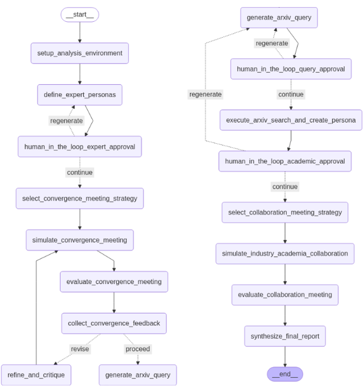

# LangGraph Workflow for Adaptive Decision Processes

## Overview

This repository demonstrates a **LangGraph-based workflow** designed for dynamic, adaptive decision-making processes. The workflow integrates expert-driven approvals, iterative refinements, and conditional routing to optimize outcomes. A visual representation of the workflow, generated using **Mermaid**, is provided in **LangGraph.png**.

The workflow builds upon modular components to create a robust, cyclic graph system that handles real-time feedback, ensuring efficiency in complex, multi-stage processes.

---

## Features

### Core Functionalities
- **Conditional Routing**: Dynamically adjusts workflow pathways based on real-time decisions.
- **Human-In-The-Loop Oversight**: Incorporates critical expert reviews at key decision points.
- **Iterative Refinement**: Integrates feedback loops for continuous process improvement.
- **Visualization**: Provides detailed graphs of the workflow architecture.

### Contribution Highlights
- Workflow Design and Implementation: **Yong-Jae Lee**
- Visualization Development: **Yong-Jae Lee**
- Analysis Process Coordination: **Yong-Jae Lee**
- Results Documentation and Release Planning: **Yong-Jae Lee**

---

## Workflow Structure

### Step-by-Step Breakdown

1. **Initialization**:
   - **Node**: `setup_analysis_environment`
   - Prepares the system environment and prerequisites for analysis.

2. **Expert Persona Engagement**:
   - **Nodes**:
     - `define_expert_personas`
     - `human_in_the_loop_expert_approval`
   - Incorporates domain experts into the decision-making process.

3. **Collaboration Strategy and Simulation**:
   - **Nodes**:
     - `select_convergence_meeting_strategy`
     - `simulate_convergence_meeting`
   - Plans and tests collaboration strategies.

4. **Feedback and Refinement**:
   - **Nodes**:
     - `evaluate_convergence_meeting`
     - `collect_convergence_feedback`
     - `refine_and_critique`
   - Integrates feedback into an iterative process for optimization.

5. **Final Synthesis**:
   - **Node**: `synthesize_final_report`
   - Produces an actionable report summarizing the workflow's results.

### Conditional Routing Logic
- **Expert Approval**:
  - Routes to `continue` or `regenerate` based on expert evaluation.
- **Feedback Evaluation**:
  - Directs workflow to either `proceed` or `revise` based on feedback.
- **Query and Academic Validation**:
  - Manages iterative adjustments until conditions are met.

---
